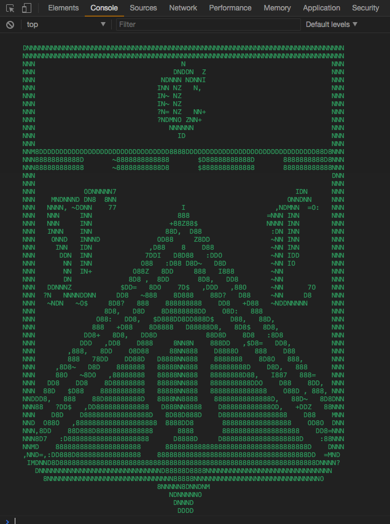

# FCO's ASCII shield

<p align="center">
  
</p>

## Install
```bash
npm install ferrocarriloeste --save
```

## Use
```javascript
require('ferrocarriloeste')
```
Or

```javascript
import 'ferrocarriloeste'
```
